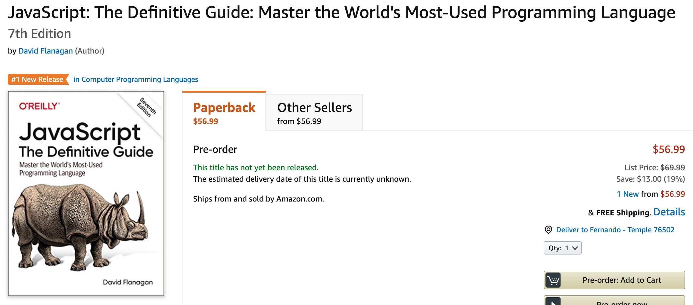

# JavaScript for New Programmers

- Enrollment is free - it's a way for me to do I love to do... teach and also a way to give back
- This means you pay nothing upfront before or after
- There are no upsells and no gimmicks
- Clases will begin Sunday May 17 from 2PM-5PM.  This schedule is tentative depending on feedback I get from student candidates.
- If you are interested please shoot me an email at beginningprogrammer.com@gmail.com.
- Must have wifi connection and a computer with Linux, Windows or Mac OS with at least 8GB Ram.  The 8GB requirement is to get a decent video connection.

This is a course designed for total new programmers that know nothing or next to nothing about JavaScript.

This program is designed by me, Fernando Zamora, and it is intended to be taught primarily in a virtual teleconference environment like zoom or skype.  It could potentially be taught in a classroom, but it's primary design is for teaching in online.

---

## Resources

### JavaScript the Definitive Guide - 7th Edition (not required but recommended)
I recommend this great book to use as an additional resource for the course.

## About Me

Twitter: [@fernandozamoraj](https://twitter.com/fernandozamoraj)

Blog: [https://codemorsels.com](https://codemorsels.com/)

LinkedIn: [https://www.linkedin.com/in/fernandozamoraj/](https://www.linkedin.com/in/fernandozamoraj/)

Fernando Zamora is a software engineer with 20 years experience.  He holds
a B.S. in Computer Science from Tarleton State University and a Masters of Science from Texas A&M University Central Texas.  

Fernando also has many hours tutoring experience in many programming languages to include JavaScript, Python, C#, C and C++, as well as many hours teaching experience in topics related to software development.

---

# Course Outline

## Week 1 - Introduction and Setup
### 1. Introduction - 
    What the course is about
    Setting the expectations
    Setting the requirements
    Providing brief and outline of the course
    
### 2. Why JavaScript?
   JavaScript can be used on the front end.
   JavaScript can be used on the back end with Node.js.
   JavaScript can run on the console.
   "Anything that can be written in JavaScript will be written in JavaScript"

### 3. Install Visual Studio Code
    Quick overview
    Plugins for Visual Studio Code
    Some necessary plug ins

### 4. Install Node.js
    Some quick overview of node

### 5. Beginning with Git - Git is the defacto way of sharing code with others and 
   git clone
   git add .
   git commit -m "I did this or that"
   git push origin master

### 6. Installing Node.js
### 7. Homework

## Week 2 - Javascript Part 1 
### 1. Variables - Primitive Types
### 2. Functions
### 3. Operators =, +, -, *, /, %
### 4. Decisions
### 5. Objects
### 6. Homework

## Week 3 - Strings and Array Methods
### 0. Pop quiz
### 1. Javascript Strings (interpolation, methods, looping)
### 2. Javascript arrays
### 3. Javascript loops
### 4. Built in functions
### 5. Homework

##  Week 4 - Functions (Higher Order) and Arrays
### 0. Pop quiz
### 1. Higher Order Functions
### 2. Callbacks - 
### 3. Arrow functions
### 4. IIFES
### 5. Optional parameters 
### 6. Default values for parameters
### 7. Homework

## Week 5 - Objects Revisited
### 0. Pop quiz
### 1. Literal Objects
### 2. Constructor functions
### 3. Classes
### 4. Properties, Dynamic Properties
### 5. Prototypical Chain
### 6. Instance vs. Static Properties Methods
### 7. Enhanced objects
### 8. Object destructuring
### 9. the mystery of this
### 10. Homework

## Week 6 - More Function Arrays
### 0. Pop quiz
### 1. Map
### 2. Reduce
### 3. Filter
### 4. Some
### 5. Closures
### 6. Array cloning and destructuring
### 7. Homework

## Week 7 - JS Magic 
### 0. Pop quiz
### 1. Hoisting
### 2. Function Arguments
### 3. Duck Typing
### 4. Truthy and Falsey
### 5. Dynamic aspects 
- undefined properties
- defined properties
- accesing propertys using square brackets
- accepting any type in a function
### 6. == vs. ===
### 7. destructuring objects, arrays, enhanced objects, const, let, arrow functions
### 8. The mistery of this
### 9. 

## Week 8 -- Algorithms
### 0. Pop quiz
### 1. Sorting
### 2. Random numbers
### 3. Reverse -  Array and String
### 4. Anagram
### 5. Palindrome
### 6. Avg, Median, Sum, Min, Max
### 7. Distance between 2 points
### 8. Sets - Intersection, Union, Difference
### 9. Convert an array into a set

## Week 9 -- Creating a node project
### 1. Create
### 2. Installing Modules
### 3. Importing Modules
### 4. Module export and import
### 5. Using fetch
### 6. Understanding HTTP
### 7. Using Axios
### 8. Calling 3 APIs and displaying the results
### 10. Homework

## Week 10 -- DOM Manipulation 
### 0. Pop quiz
### 1. CSS Primer
### 2. HTML Primer
### 3. Forms
### 4. Using Javascript get input values
### 5. Using Javascript to validate the form
### 6. Using Java to render data
### 7. Homework

## Week 11 -- Capstone Ideas
### 0. Pop quiz
### 1. Capstone Ideas
### 2. Deploy project
### 3. Exam Review
### 4. Homework Work on Capstone Project (instructions for capstone)

## Week 12 -- Show off capstone to group
### 0. Complete Exam
### 1. EOC Survey
### 2. Show off capstones
### 3. What next?
       - With this knowledge you can expand your knowledge of CSS
       - Expand knowledge of HTML
       - Expand your knowledge of creating a back end with Node
       - Learn React, Angular or Vue

